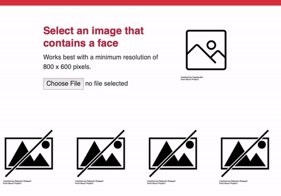

# PoseNet Face Detection


### About
Quickly detect multiple faces within a group photo. This **browser-side utility** takes an image ([Image Data URL](https://developer.mozilla.org/en-US/docs/Web/HTTP/Basics_of_HTTP/Data_URIs)) with multiple people, such as group photo / selfie / portrait / etc. and outputs an array of faces (Image Data URLs). Additional controls include ability to control the accuracy of the image and maximum number of faces to be detected from the orignal image. 

#### Privacy
Images or image data is not saved or uploaded to any cloud service. All detections happen on the browser side without leaving the device. Utility does not require an active internet connection at runtime.


### Usage
Because **PoseNet Face Detection** leverages TensorflowJS and PoseNet model to identify body landmarks, these packages must be first imported.


```
<script src="https://cdn.jsdelivr.net/npm/@tensorflow/tfjs/dist/tf.min.js"> </script>
<script src="https://cdn.jsdelivr.net/npm/@tensorflow-models/posenet"></script>

<!-- Finally, also include`face-detection.js` -->
<script src="https://cdn.jsdelivr.net/gh/mppise/posenet-face-detection/dist/main.js"></script>
```

Once the packages are imported, 

Assuming you have an input control to upload an image,

```
<input type="file" name="imagePicker" id="imagePicker" 
    onChange="loadImageFromDevice(event)" 
    accept="image/png, image/jpeg">
```

1. upload an image using FileReader object

```
 function loadImageFromDevice(event) {
    const file = event.target.files[0];
    const reader = new FileReader();
    reader.readAsDataURL(file);
    reader.onload = () => {
        let imageDataURL = reader.result; 
        /*
        ..
        .. [to step 2]
        ..
        */
    };
 }
```

2. Call`detectFaces(imageDataURL)`, which returns a promise.

An optional `options` object  can be passed containing following parameters. Note: All parameters are optional.

```
let options = {
    accuracy: 0.4,  // default: 0.2, i.e. 20%
    maxFaces: 5,    // default: 10
};

detectFaces(imageDataURL, options)
    .then((faces) => {
        console.log(faces); // Array of faces as Image Data URL's.
          /*
        ..
        .. [display images within 'img' tags]
        .. [e.g. document.getElementById('face1').setAttribute('src') = faces[0]]
        ..
        */
    }).catch((err) => console.log(err));
```

  


### Demo
Clone this repository and run `index.html` within the `demo/` directory.


### References:
- [Pose Detection in the Browser: PoseNet Model](https://github.com/tensorflow/tfjs-models/tree/master/posenet)
- [Real-time Human Pose Estimation in the Browser with TensorFlow.js](https://medium.com/tensorflow/real-time-human-pose-estimation-in-the-browser-with-tensorflow-js-7dd0bc881cd5)

